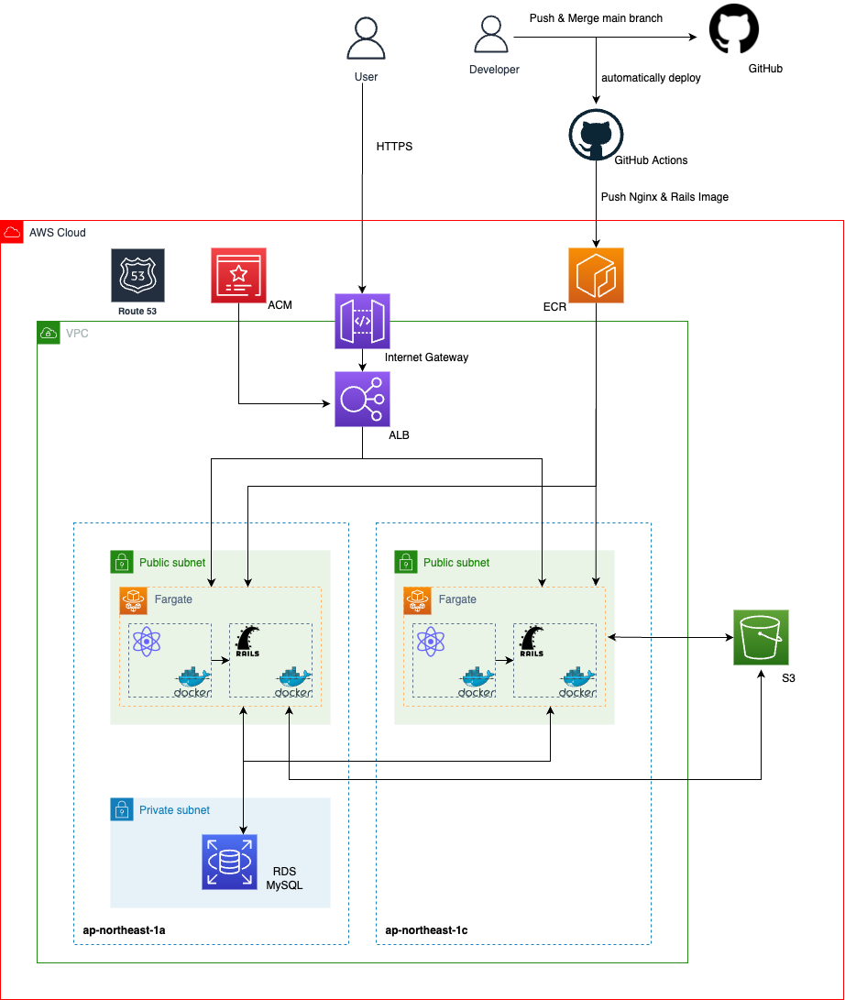

# 看護師国家試験対策アプリ PeAN

## 概略

看護師の国家試験対策は、5cm 程ある分厚い本で行うのが主流で、10 年前から学習方法がほとんど変わっていません。

看護師の国家試験問題は、計算や考える問題というよりは、知識を問う暗記問題が大部分を占めるため、繰り返し問題を解く時間を作ることが大切です。

**_「分厚い本を見ると、なんか眠たくなる」_**

**_「机にしがみつくのが苦手」_**

そんな悩みを解消するために、ゲーム要素を取り入れて、机に向かえる時間を少しでも長くできるように、看護師国家試験対策アプリ「PeAN」を作成することにしました。

PeAN の由来は、看護師１年目のみんなが買う必須アイテム「ペアン鉗子」です。

## 技術スタック概略（詳細後述）

- Frontend: TypeScript, React
- Backend: Ruby, Ruby on Rails
- infra: AWS, Docker, GitHub Actions

## 技術スタック詳細

### Frontend

- 言語：TypeScript
- 主要なライブラリー：React
- コンポーネントライブラリー：Material-UI, styled-components
- リンター：ESlint, Prettier
- テスト：Jest
- 状態管理：Redux, Rudux thunk, Hooks
- web サーバー：nginx

### Backend

- 言語：Ruby
- フレームワーク：Ruby on Rails
- リンター：rubocop
- テスト：RSpec
- アプリケーションサーバー：Unicorn
- 認証 gem：devise-token-auth

### Infra

- AWS

  - ECS Fargate
  - ECR
  - RDS(MySQL)
  - ALB
  - Route53
  - S3
  - ACM
  - AWS CDK(TypeScript で記述）

- テスト：@aws-cdk/assertions

- Docker
- GitHub Actions(CI/CD)

## 機能一覧

### ユーザー利用機能

- 認証機能
  - ログイン機能（トークン認証）
  - ユーザー新規登録機能
  - ログアウト機能
- ユーザー関連
  - プロフィール画像変更機能
  - パスワード変更機能
  - レベルアップ機能
- クイズ関連
  - クイズ回答機能
  - 学習積み上げ機能(GitHub の草）
  - 全問正解したコースの管理機能
- 問い合わせメール送信機能

### 管理者利用機能（ユーザーがアクセスできない管理者画面でのみ利用可）

- 認証機能
  - 管理者ログイン機能（トークン認証）
  - 管理者ログアウト機能
- ユーザー関連
  - ユーザー削除機能
- クイズ関連
  - クイズ作成・更新・削除機能
  - カテゴリー画像登録機能

### 非ユーザー利用機能

- GitHub Actions による CI/CD パイプライン
  - CI: RSpec, rubocop, eslint, jest
  - CD: AWS ECR
- 開発環境と本番環境に Docker を導入し、環境の差異を吸収
- AWS CDK によるインフラのコード管理
- Route53 による独自ドメイン + SSL 化
